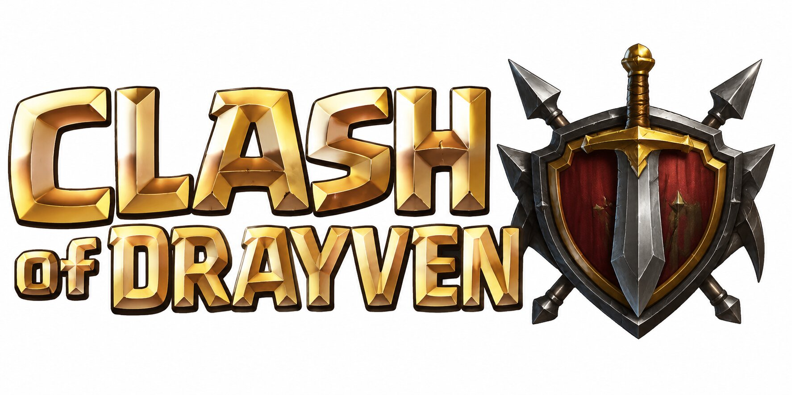

# Clash Of Drayven

**Clash Of Drayven** is an online 2D/isometric base-builder and raid game for Windows and Android, developed under the IrAutoX brand.

## DrayvenEngine release architecture

The release pipeline now includes:

- a 4-second pulsing IrAutoX splash on Android and Windows; the build derives a white/dark-corrected splash from `Assets/IrAutoX.jpg`
- launcher/application icon generation from `Assets/COD.jpg`
- `Assets/vazir.ttf` for Persian UI and `Assets/IrAutoX-Magic_5.ttf` for Clash Of Drayven branding/title surfaces
- persistent login sessions; Windows uses DPAPI and Android uses AES/GCM with an Android Keystore-backed key
- Persian/RTL Android login, village HUD, troop/build labels and raid result surfaces
- native `DrayvenEngine` core compiled into `libclashofdrayven.so`
- R8/ProGuard release minification plus stripped native symbols
- Android APK packaging in the correct order: unsigned build -> `zipalign` -> `apksigner`
- signed Android App Bundle (`.aab`) output for Google Play Console upload
- exactly 20 SHA-256-verified runtime asset packs: `CLDRYPK1` ... `CLDRYPK20`
- Windows UPX `--best --lzma` attempt with validation and automatic fallback

## Android production signing

Production releases are designed to use one persistent IrAutoX keystore stored only in GitHub Actions Secrets:

- `ANDROID_KEYSTORE_B64`
- `ANDROID_STORE_PASSWORD`
- `ANDROID_KEY_PASSWORD`
- `ANDROID_KEY_ALIAS` (recommended: `irautox`)

The private keystore must never be committed to this public repository. A stable key lets Android accept future APK updates from the same signer. Google Play trust is separate: for Play distribution, register the app in Google Play Console and use Play App Signing / the configured upload key. A locally valid signature by itself cannot make an app appear as Google-Play-verified.

## Native security boundary

`DrayvenEngine` is the native boundary for logic that should not live plainly in DEX. JNI is deliberately small and the release uses hidden native symbols and section garbage collection. This increases reverse-engineering cost, but it is not a substitute for server-side authority: database credentials, signing private keys and authoritative game secrets must remain off the client.

## Asset pipeline

`scripts/fetch_assets.py` prepares the open runtime assets. `scripts/prepare_branding.py` generates platform branding from the repository-owned artwork and copies the provided fonts into the Android asset tree. `cldrypk pack20` then builds the twenty verified runtime packs.

See `THIRD_PARTY_NOTICES.md` and `PACK_FORMAT.md`.
